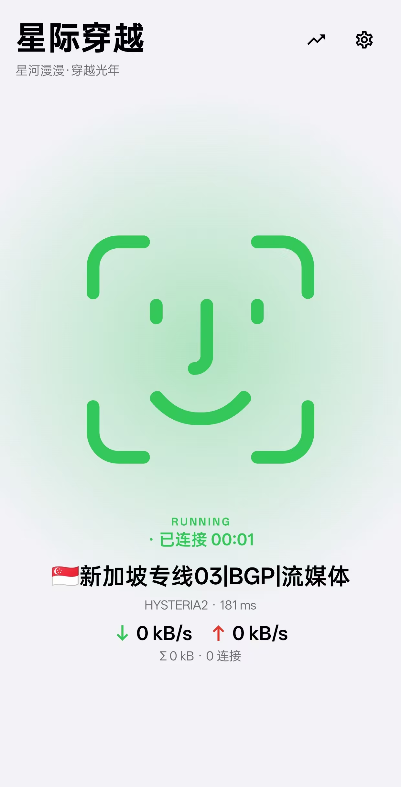

<div align="center">


# 星际穿越 · interstellar

**星河漫漫， 穿越光年。**

Android 7.0+ · v0.2.0 · Kotlin + Jetpack Compose

</div>

> 图标是一家之主汉克——星际穿越的唯一主题就是回家。

Android 上的 sing-box 代理客户端。UI 采用 iOS 系统设计语言：极简、聚焦、单一强调色、分组内嵌列表、大按钮即应用。

<div align="center">

</div>

## 功能

### 内核与代理

- **sing-box 1.14 内核**：本地 gomobile 构建的 `libbox.aar`（四 ABI + universal），VPN（TUN）模式
- **双服务模式**：VPN（TUN）/ 代理模式，支持 allowBypass、autoRedirect
- **出站模式**：规则 / 全局 / 直连
- **快捷磁贴**：系统下拉快捷开关一键启停，状态与内核实时同步
- **电池优化豁免**：状态化引导，已豁免后点击跳转应用详情，返回自动刷新

### 订阅

- **多格式导入**：Clash YAML / 分享链接（ss·vmess·vless·trojan·hysteria2·tuic·anytls…）/ Base64 自动嗅探
- **导入方式**：URL（伪装 clash-verge UA，解析 `subscription-userinfo` 流量头）、文本导入、剪贴板自动识别
- **流量显示**：剩余流量 / 到期信息
- **自动更新**：WorkManager 定时拉取（1/6/12/24h），运行中热重载
- **Mix 多订阅合池**：多订阅节点合并为单一池并标注来源，流量/到期仍按订阅独立
- **机场兼容**：自动过滤「剩余流量/到期」等信息假节点

### 节点

- **热切换**：libbox `CommandClient` 直连本地 abstract socket，切换/测速/日志/状态无需 HTTP API、不重启内核
- **URL Test 测速**：延迟着色，未连接状态也可列出并测速
- **布局**：网格（最多 3 列）/ 列表双布局，状态持久化
- **分组**：地区分组吸顶折叠、排序、长按详情；可选按国家 urltest 分组（香港/新加坡/…）
- **自动卡片**：实时显示当前出口节点，选中项呼吸动画

### 分流规则

- **内置大陆分流**：`geoip-cn.srs` + `geosite-cn.srs` 随 APK 打包（`assets/rules/`），首次启动拷贝到 `filesDir/rules` 以 local rule-set 引用——大陆域名/IP 直连，无需在线下载（规避 raw.githubusercontent 直连不通的死锁）
- **去广告**：`category-ads-all.srs` 内置规则集，一键拦截广告/跟踪域名
- **局域网直连**：RFC1918 / ULA / 链路本地地址直连并排除出 TUN
- **自定义规则**：域名 → 节点关键词分流，命中域名走独立 urltest 池；总开关独立于节点选择（锁定节点也不影响分流）

### 分应用代理

- 白名单 / 黑名单两种模式
- 应用列表（图标 + 搜索 + 批量选择 + 常用应用预置）
- 修改即时生效（内核热重载）

### 界面与交互

- **iOS 设计语言**：跟随系统深浅色、单一强调色、分组内嵌列表、iOS 开关/分段控件（灰轨白滑块）、大标题层级、推入式子页导航
- **首页**：状态标签 + 大字节点名 + 速率面板 + 笑脸表情（闲置动画：眨眼/呼吸）、马卡龙六色光晕（抹茶/蜜桃/香芋/湖蓝/柠檬/晚霞，默认抹茶，切换带过渡动画并持久化）、左滑进设置
- **通知卡片**：标题「星河漫漫 · 穿越光年」，VPN 系统名「星际穿越」
- **连接监控**：活跃连接实时列表（域名/规则/链路/速率），单条/全部断开
- **日志页**：内核日志实时流 + 一键复制导出
- **交互细节**：按压缩放反馈、底部弹层快速切换、下拉刷新、滑动删除、触感反馈；竖屏锁定

## 项目结构

```
app/src/main/java/com/interstellar/proxy/
├── bg/                    # 服务层（移植自 sing-box-for-android 最小集）
│   ├── BoxService.kt      # CommandServer 生命周期粘合
│   ├── VPNService.kt      # VpnService.Builder / openTun / protect
│   ├── ProxyService.kt    # 代理模式服务
│   ├── QuickTileService.kt# 快捷磁贴
│   ├── PlatformInterfaceWrapper.kt / LocalResolver.kt（系统 DNS）
│   ├── DefaultNetworkMonitor.kt / DefaultNetworkListener.kt
│   └── ServiceNotification.kt / ServiceBinder.kt
├── data/
│   ├── model/             # ProxyNode（统一节点模型）/ CustomRouteRule
│   ├── subscription/      # SubscriptionParser（嗅探）/ ClashParser / UriParser / SingboxOutboundConverter
│   ├── config/ConfigBuilder.kt  # sing-box JSON 生成（对应桌面端 builder.rs/dns_build.rs）
│   ├── net/SubscriptionFetcher.kt
│   ├── SubscriptionRepository.kt / UpdateWorker.kt（定时更新）
│   ├── CustomRulesStore.kt / RulesStore.kt / NodeMatcher.kt
│   └── Settings.kt / ConfigStore.kt
├── ui/
│   ├── theme/             # Theme.kt（深浅色）/ GlowPalette.kt（光晕马卡龙色）/ Motion.kt
│   ├── AppViewModel.kt    # CommandClient 状态/组/模式订阅 + 业务动作
│   ├── components/        # IosComponents / FaceMark（笑脸）/ MotionComponents
│   └── pages/             # Dashboard（首页）/ Proxies（节点+订阅双 tab）/ Connections / Logs / Settings / PerAppProxy / CustomRules
└── utils/                 # CommandClient / CommandTarget
```

## 构建

1. **libbox.aar**（已含在 `app/libs/`，如需重建）：
   ```bash
   # 需要 Go 1.26+、NDK r28、JDK
   cd /path/to/sing-box && make lib_android
   # 产物 libbox.aar 拷贝到 app/libs/
   ```
   本项目使用 tag `v1.14.0-beta.17`，`-javapkg=io.nekohasekai -libname=box`。

2. **APK**：
   ```bash
   ./gradlew assembleDebug    # 地心游记（.debug 后缀包名，与正式版共存）
   ./gradlew assembleRelease  # 星际穿越（按 ABI 分包，约 40MB/个）
   ```
   - 签名：根目录 `signing.properties`（gitignored），缺失时 release 自动回退 debug 签名，fresh checkout 也能构建。
   - 网络受限环境可用 `mirrors.cloud.tencent.com/gradle` 发行镜像（已在 wrapper 配置）。

## 技术要点

- 内核控制全部走 libbox `CommandClient`（本地 abstract socket），节点热切换/测速/日志/状态无需 HTTP API
- 配置生成遵循 sing-box 1.11+ 规范：rule actions、typed DNS servers、tun `address` 字段
- 生成后 `Libbox.checkConfig` 校验，失败即拒绝写入
- 前台服务 `systemExempted`（VPN）/ `specialUse`（代理），符合 Android 14+ FGS 规范
- 技术栈：Kotlin + Jetpack Compose（Material3）、kotlinx-serialization、kaml（YAML）、OkHttp、WorkManager

## Roadmap

- [ ] 内置规则集定期更新（随版本发布更新 .srs）
- [ ] 智能切换（移植 smart_switch.rs）
- [x] 订阅自动更新（WorkManager）
- [x] 分流规则自定义（域名 → 节点关键词）

## 致谢

- [sing-box](https://github.com/SagerNet/sing-box) — 内核
- [sing-box-for-android (SFA)](https://github.com/SagerNet/sing-box-for-android) — 服务层移植参考
